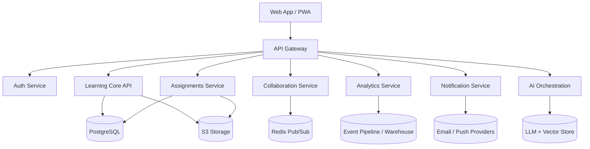

# Learning OS Architecture

## Frontend
- Next.js or React client with route-level code splitting.
- PWA support for offline reading, cached class resources, and queued actions.
- TanStack Query for server state and optimistic updates.
- Design system based on shared tokens, motion, and accessible components.

## Backend
- API-first Node.js service built around Express initially, with a clear path to NestJS or modular service extraction.
- PostgreSQL as the system of record.
- Redis for cache, rate limiting, session coordination, and realtime presence.
- S3-compatible storage for files and media.
- SSE today, WebSockets when collaboration traffic grows.

## Service Modules
- Auth service for JWT/OAuth, RBAC, and session lifecycle.
- User and role management service.
- Classes and content service.
- Assignments and grading service.
- Analytics engine for event aggregation, risk scoring, and recommendations.
- Notification service for in-app, email, and push delivery.
- AI orchestration service for summaries, quizzes, feedback, and intervention prompts.

## System Flow

## Scaling Strategy
1. Start as a modular monolith with bounded contexts.
2. Move async work into queues and workers.
3. Add Redis caching for hot reads and rate limits.
4. Split collaboration, analytics, and AI into separate services once throughput requires it.
5. Keep API contracts versioned so the frontend can evolve independently.
